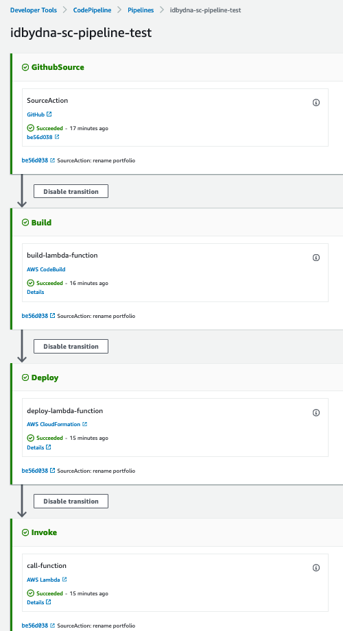
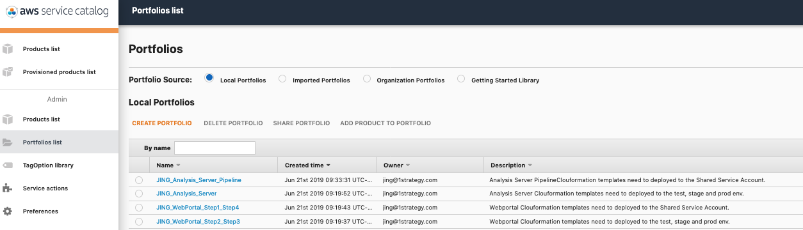
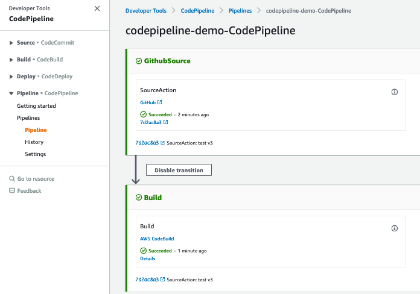
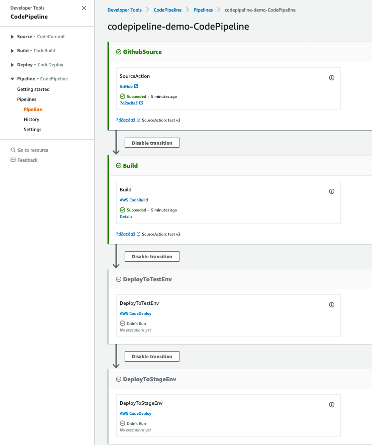
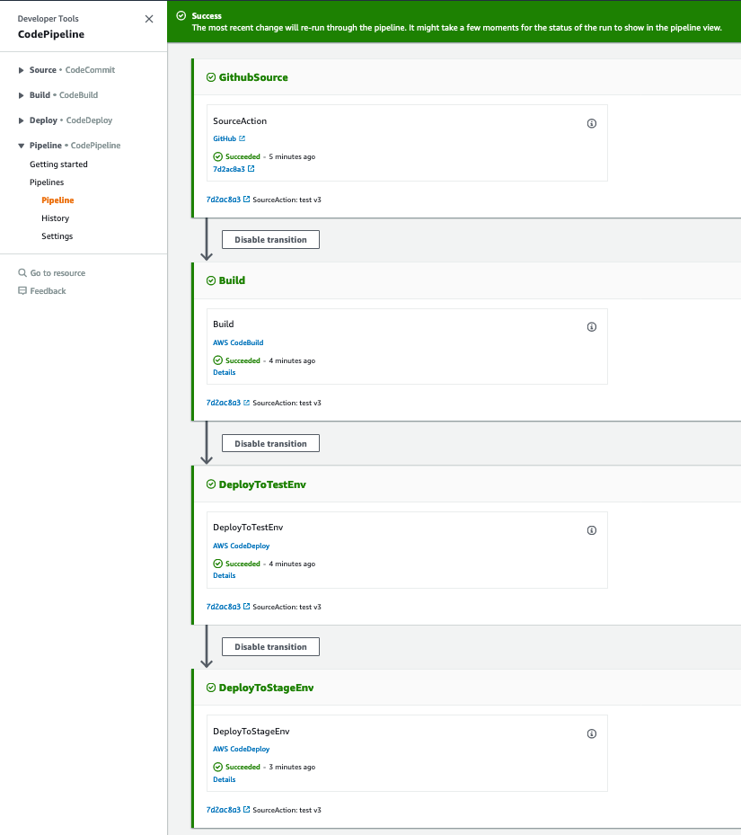
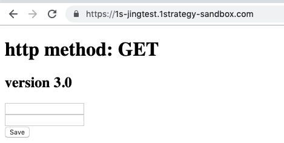
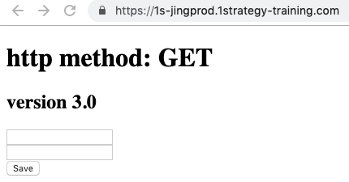
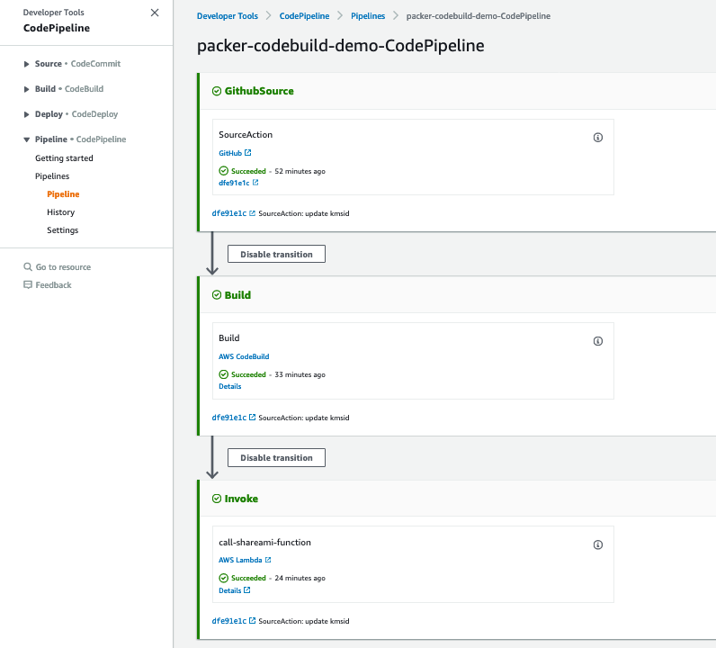
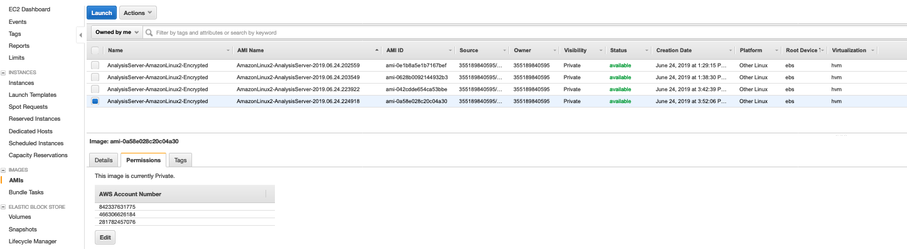

# Manage Cloudformation Templates and Pipelines
The solution that managing the cloudformation templates using service catalog comes from AWS DevOps Blog [Building a Continuous Delivery Pipeline for AWS Service Catalog](https://aws.amazon.com/blogs/devops/aws-service-catalog-sync-code/).

## Step 0: Set Up Prerequisites

1. [Install](https://docs.aws.amazon.com/cli/latest/userguide/cli-chap-install.html) and [configure](https://docs.aws.amazon.com/cli/latest/userguide/cli-chap-configure.html) AWS CLI point to the shared-services account
2. Generate Github personal access tokens

You need personal access tokens to access your GitHub repositories and retrieve the latest changes when you use the CLI, SDK, or AWS CloudFormation to create or update your pipeline. As a security best practice, do not share a single token across multiple applications, Create a personal access token for each application.

* In GitHub, from the drop-down option on your profile photo, choose Settings.

* Choose Developer settings, and then choose Personal access tokens.

* Choose Generate new token.

* Under Select scopes, select admin:repo_hook and repo.

* Choose Generate token.

* Next to the generated token, choose the copy icon. (Make sure you copy your generated token at this time. You cannot view the token after you close this page.)

## Set up CodePipeline for Cloudformation Templates

1. Update mapping.yaml under each portfolio- folder. **Note: The name of the folder must start with portfolio- because the AWS Lambda function iterates through all folders whose names start with portfolio-, and syncs them with AWS Service Catalog.**

2. Check in files under this project to a Github repository

3. Create the service catalog pipeline in the shared-services account primary region, below is the command with sample parameters:

```bash
aws cloudformation deploy --template-file pipeline-to-service-catalog.yaml --stack-name idbydna-sc-pipeline-test --capabilities CAPABILITY_NAMED_IAM --parameter-overrides RepositoryName=pipeline-to-service-catalog GithubPersonalToken=xxxxxxxxxxxxxxxxxxxxxx
```

4. After the cloudformation stack created complete, go to the codepipeline console, a codepipeline with the same name as the cloudformation stack should be there and executed successfully:



Then go to the service catalog service, profilios should be created based on the settings in the mapping.yaml files:



5. Go to each application account to import the shared porfolios from the shared-services account

* In the shared-service account service catalog console, record the Portfolio ID of the Portfolio that shared with application accounts (e.g. "port-q4kfbydp6n4ye")

* Go to each application account > service catalog console > Portfolios list, click [Imported Portfolios], then click [Imported Portfolios], enter the Portfolio ID you copied from last step, then click [IMPORT]

* Click the Portfolios you just imported, expand "Users, groups and roles", grant access to the portfolio in this account

* Repeat above steps to import [xx_Analysis_Server] and [xx_WebPortal_Step2_Step3] to the test, stage and prod account

## Set up CodePipeline for WebPortal

## Step 1: Deploy prerequisites-step1.yaml in the shared-services account

1. In the shared service account, go to service catalog console > Products list

2. Click product [webportal-prerequisites-step1], click [LAUNCH PRODUCT]

3. Choose the latest version and provide a name for the stack then click [NEXT]

4. Check and update the default parameters, then click [Next]

5. Use default values of other settings then click [LAUNCH]

This template will create below resource and will be used by other templates:

* S3 bucket for CodePipeline artifacts, with bucket policy to allow access from application accounts (test, stage and prod).

* KMS customer master keys (CMKs) used to encrypt the above S3 bucket, with key policy to allow access from application accounts (test, stage and prod).

6. Wait until the launch complete, go to cloudformation console, select the cloudformation just created complete, in the [Outputs] tab, record the value of [CMKKeyArn], you will use it later.

## Step 2: Deploy review-portal-asg-step2.yaml to all application accounts 

1. In the test account, go to service catalog console > Products list

2. Click product [review-portal-asg-step2], click [LAUNCH PRODUCT]

3. Choose the latest version and provide a name for the stack then click [NEXT]

4. Check and update the default parameters, input [CMKArn] you copied in the last step then click [Next]

5. Repeat above steps (1 - 4) to launch product [review-portal-asg-step2] in the stage and prod accounts.

This template will create the webportal environment including web server, autoscaling group, application load balancers and DNS records.

Please update the parameters with the account specific info.

## Step 3: Deploy webportal-codedeploy-step3 to all application accounts

1. In the test account, go to service catalog console > Products list

2. Click product [webportal-codedeploy-step3], click [LAUNCH PRODUCT]

3. Choose the latest version and provide a name for the stack then click [NEXT]

4. Check and update the default parameters, then click [Next]

5. Repeat above steps (1 - 4) to launch product [webportal-codedeploy-step3] in the stage and prod accounts.

This template will create CodeDeploy applicaion and deployment group with IAM roles and policies in the application accounts. It will also help set up the trust relationship of the cross account role to allow to be consumed by the Shared-Services account.

This template will create below resource:

* CodeDeployApplication
* CodeDeployDeploymentGroup
* CrossAccountCodeDeployPolicy
* CrossAccountCodeDeployServiceRole

## Step 4: Deploy webportal-codepipeline-step4.yaml in the shared-services account

1. In the shared service account, go to service catalog console > Products list

2. Click product [webportal-codepipeline-step4], click [LAUNCH PRODUCT]

3. Choose the latest version and provide a name for the stack then click [NEXT]

4. Check and update the default parameters, provide the [GithubPersonalToken
], then click [Next]

5. Use default values of other settings then click [LAUNCH]

This template will create a CodePipeline in the shared-service account to get source code from Github, build the code using CodeBuild. Allow codepipeline IAM role assume CrossAccountCodeDeployServiceRole in the application accounts.

This template will create below resource:
* AppPipelineWebhook
* CodeBuildPolicy, CodeBuildRole, CodeBuildProject
* PipelinePolicy, PipelineRole, WebPortalPipeline

At this point, you should have a codepipeline created with Source and Build Stage:



## Update the pipeline adding deployment stages
You cannot use the CodePipeline console to create or edit a pipeline that uses resources associated with another AWS account. However, you can use the console to create the general structure of the pipeline, and then use the AWS CLI to edit the pipeline and add those resources.

1. At a terminal, run the get-pipeline command on the pipeline to which you want to add resources. e.g. codepipeline-demo-CodePipeline

```shell
aws codepipeline get-pipeline --name codepipeline-demo-CodePipeline > pipeline.json
```

2. Open the JSON file in any text editor, add the deployment stages to the pipeline, save the file.

3. Run the update-pipeline command to apply your changes, specifying the pipeline JSON file

```
aws codepipeline update-pipeline --cli-input-json file://pipeline.json
```

Then the deployment stages should be added to the pipeline:



Click [Release change] on the console, and the pipeline should run successfully.

4. Verify the pipeline: make a change in the sample application, and push the change to the github repository, then the pipeline should be triggered:



And the code change should show up in the webportal URL in each account.





## Set up CodePipeline for Analysis Server

The purpose of the analysis server codepipeline is to create an AMI with the latest analysis server code installed.

The cloudformation template to launch this pipeline is portfolio-analysis-server-pipeline-sharedservices-acct/product-analysis-server-codepipeline.yaml. At this point, you should already deployed this template to the service catalog in the shared-services account.

1. In the shared service account, go to service catalog console > Products list

2. Click product [analysis-server-codepipeline], click [LAUNCH PRODUCT]

3. Choose the latest version and provide a name for the stack then click [NEXT]

4. Check and update the default parameters, provide the [GithubPersonalToken
], then click [Next]

5. Use default values of other settings then click [LAUNCH]

After the cloudformation created completed, the analysis server pipeline should be created, and the pipeline will **Fail** at the Build stage. The reason of the fail is that packer is not using the newly generated CMK and security group.

6. Go to the cloudformation console, check [Outputs] tab, get the AnalysisServerCMKKeyArn and PackerEC2InstanceSecurityGroup, then update the "CreateAMI.json" in the analysis server source code repo, then push the change to the github repo. 

7. The analysis server code pipeline will be triggered:



After pipeline executing completed, go to EC2 > AMI, a new AMI is generated and shared with test, stage and prod accounts:

